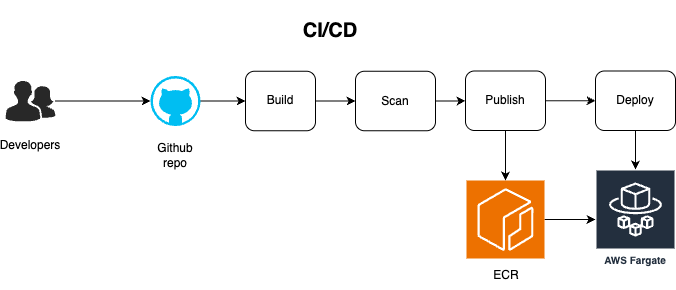

# hx-app

A minimal Python HTTP server that responds to basic GET requests.

## 🛠 What It Does

This app serves a simple HTTP server using Python’s `http.server` module.

It listens on port `80` and responds with:

- `GET /` → `200 OK`, returns **"Home"**
- `GET /hello` → `200 OK`, returns **"OK"**
- Any other path → `404 Not Found`

---

This app runs on AWS using ECS Fargate and an ALB, and is designed to handle approximately **1 million requests per month**.

| Resource                         | Est. Monthly Cost (USD) | Notes |
|----------------------------------|--------------------------|-------|
| **ECS Fargate (CPU + RAM)**      | ~$9.80                   | 1 task, 256 vCPU, 512 MB RAM, always on |
| **Elastic Load Balancer (ALB)**  | ~$21.00                  | Fixed hourly + per-request fee |
| **Data Transfer (Outbound)**     | ~$10.00                  | 10 GB outbound (approx) |
| **ECR (Image Storage + Pulls)**  | ~$0.20                   | Small image + minimal pulls |
| **S3 (Terraform backend)**       | ~$0.10                   | Tiny usage for state file |
| **IAM roles & networking infra** | $0.00                    | No direct cost |
| **Total**                        | **~$41.10/month**        | For 1M requests |

### 📌 Assumptions:
- Region: `ap-southeast-2` (Sydney)
- Load Balancer handles 1M requests
- Fargate task is running 24/7 with low traffic
- Outbound response size: ~10 KB avg

## 🧠 Design Philosophy

This project is purposfully split into **two separate repositories**:

1. **App Repository (`dtony-hx`)**
   - Contains application code (`app.py`)
   - Dockerfile and GitHub Actions workflow to build, scan, and deploy
   - Manages **its own ECS task definition**

2. **Infrastructure Repository (`dtony-hx-infra`)**
   - Provisions AWS infrastructure using Terraform
   - Includes VPC, subnets, ECS cluster, ALB, security groups, and IAM roles
   - Manages shared/cloud infra that should be versioned and deployed independently

#### ✅ Avoid Configuration Drift
If both app and infra live in the same repo, teams may unintentionally sync or override infrastructure state (especially when multiple services share a cluster or ALB). Separation ensures clean ownership boundaries.

#### ✅ Enable CI/CD Without Terraform Knowledge
The app repo can:
- Build Docker images
- Scan them with security tools
- Render and register ECS task definitions
- Deploy the service

All without needing access to `main.tf` or deep infra understanding.

#### ✅ Safe Iteration by Separate Teams
Infra changes are slower and riskier (networking, IAM, etc). App teams should not have to wait on infra PR approvals just to deploy a fix. This model unblocks them.

#### ✅ Decoupled Deploy Lifecycles
Infrastructure can evolve at its own pace:
- Add support for blue/green, autoscaling, etc
- Without needing every app to update their repo

## 🧱 Infrastructure

> ℹ️ **Note:** Infrastructure is provisioned in a **separate repo** using Terraform.  
This app assumes the following are already created:

- ECS Cluster (`hx-cluster`)
- ECS Fargate Service (`hx-service`)
- IAM roles for task execution
- ALB + Target Group + Listener
- VPC, Subnets, and Security Groups

---

### 🔁 CI/CD Workflow

The GitHub Actions workflow does the following on push to `main`:

1. **Build** Docker image using the latest Git commit SHA as the tag
2. **Scan** the image with Trivy for CRITICAL/HIGH vulnerabilities
3. **Push** the image to Amazon ECR
4. **Render** the ECS Task Definition by replacing template variables
5. **Deploy** the new task definition to an ECS service (`hx-cluster` > `hx-service`)
6. **Wait** for service stability



---

## 🚀 How It Gets Deployed

This application is containerized and deployed to **AWS ECS Fargate** using **GitHub Actions**.

---
## 📦 Project Structure

```
.
├── app/
│   └── app.py                  # Python server
├── Dockerfile                 # Image definition
├── .github/workflows/
│   └── main.yml               # CI/CD workflow
├── task-definition.template.json
└── README.md
```

---

## 🧪 Local Testing

```bash
sudo python app/app.py
curl http://localhost/
curl http://localhost/hello
curl http://localhost/notfound
```

---

## 🌐 After Deployment

Once deployed to ECS, the app will be reachable via the Application Load Balancer URL.

Example:

```bash
curl http://hx-app-alb-2127162870.ap-southeast-2.elb.amazonaws.com/hello
```

---

## 🔐 Security Notes

- Uses GitHub OIDC for AWS access (no long-lived secrets)
- Trivy scans images before deployment
- Based on `python:3.12-slim` for minimal attack surface

---

## 📝 License

MIT
